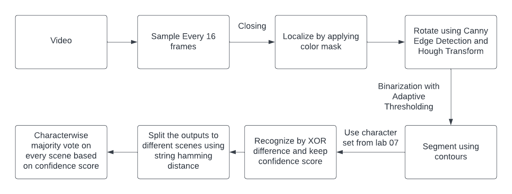

# License Plate Recognition

The goal of this project is to recognise the car license plates visible in a video, in sufficient time. The project focuses on the recognition of Dutch license plates, which are obliged to have black characters and a yellow background. To achieve this, the openCV framework is used. More details about the implementation of each component of the pipeline and the final results can be found on the accompanying [posters](Posters). This project was completed as part of the CSE225 Image Processing course of the BSc on Computer Science and Engineering at TU Delft.

## Authors

The contributors of this project are [Georgios Kontos](https://github.com/GeorgeKontos14) and [Konstantinos Baktalias](https://github.com/konstantinosbaktalias).